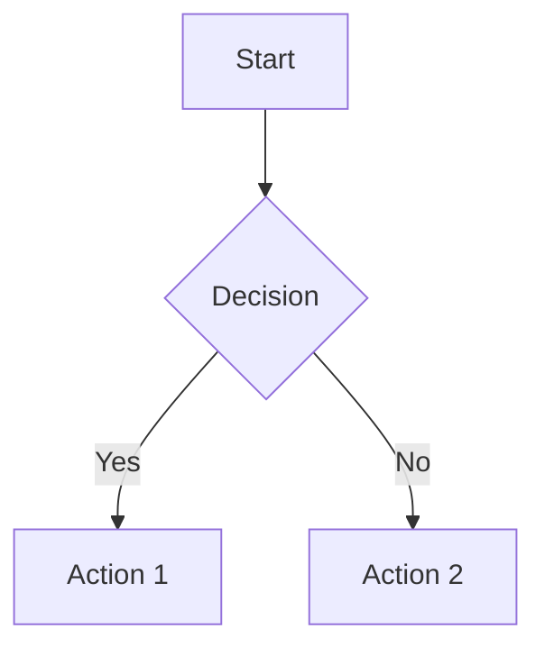

- [基础语法](#基础语法)
- [扩展语法](#扩展语法)
- [特殊元素](#特殊元素)
- [其他测试](#其他测试)


[← 返回首页](/)
| [Astro](https://docs.astro.build/en/getting-started/)
| [Tailwind](https://tailwindcss.com/docs/opacity)
| [MDUI](https://www.mdui.org/zh-cn/docs/2/components/card)
| [图标列表](/icons)


## 基础语法
### 1. 代码块
```python
# hello, 你好
def test():
    x = 5
    while x < 10:
        print("围栏代码块")
        
    return
```

普通代码： `代码文本` `string`

### 2. 段落与换行
这是第一段落（行尾加两个空格  换行）  
这是新行

这是第二段落（普通换行）
这是同一段落

### 3. 强调文本
*斜体* _斜体_  
**粗体** __粗体__  
***粗斜体*** ___粗斜体___  
~~删除线~~  
`行内代码`  
<u>下划线（HTML）</u>   
==高亮（扩展语法）==  
H~2~O  
X^2^  

### 4. 列表
#### 无序列表
- Item 1
- Item 2
  - Subitem 2.1
  - Subitem 2.2
    - Sub-subitem 2.2.1

#### 有序列表
1. First item
2. Second item
3. Third item
   1. Indented item

#### 混合列表
- [x] 任务列表 1
- [ ] 任务列表 2
1. 数字列表
   - 嵌套无序列表

### 5. 链接与图片
[内联链接](https://example.com)  
[参考式链接][1]  
<!---->


<https://autolink.example.com>  

[1]: https://example.com/reference

### 6. 标题
# H1
## H2
### H3
#### H4
##### H5
###### H6

---

## 扩展语法

### 7. 表格
| 列左对齐   | 列居中对齐  |   列右对齐 |
|:-------|:------:|-------:|
| Cell 1 | Cell 2 | Cell 3 |
| 合并列    |        |        |
| 合并行    | Cell 5 | Cell 6 |

### 8. 引用与注释
> 普通引用
>> 嵌套引用
>> 111

脚注测试[^1]

[^1]: 这是脚注内容

### 9. 定义列表
术语1
: 定义1

术语2
: 定义2

### 10. 数学公式
$$
f(x) = \int_{-\infty}^\infty \hat f(\xi)\,e^{2 \pi i \xi x} \,d\xi
$$

行内公式：$E = mc^2$

### 11. 图表（Mermaid）


---

## 特殊元素

### 12. 目录生成
[TOC] （某些引擎支持）

### 13. HTML 混合
<div style="color: red">
HTML 块元素测试
</div>

### 14. 转义字符
\*逃逸星号\*  
\\ 反斜杠  
&#169; 版权符号

### 15. 注释
<!-- 这是隐藏的注释 -->

---

## 其他测试

### 16. 特殊符号
© ® ™ → ⇒ ± ≠ ≤ ≥

### 17. 表情符号
:smile: :rocket: （需要支持emoji的引擎）

### 18. 自动链接
<fake@example.com>  
http://auto.link

### 19. 分割线测试
---
***
___

### 20. 特殊代码块
```diff
+ 新增行
- 删除行
```

```json
{
  "key": "value"
}
```


(完)